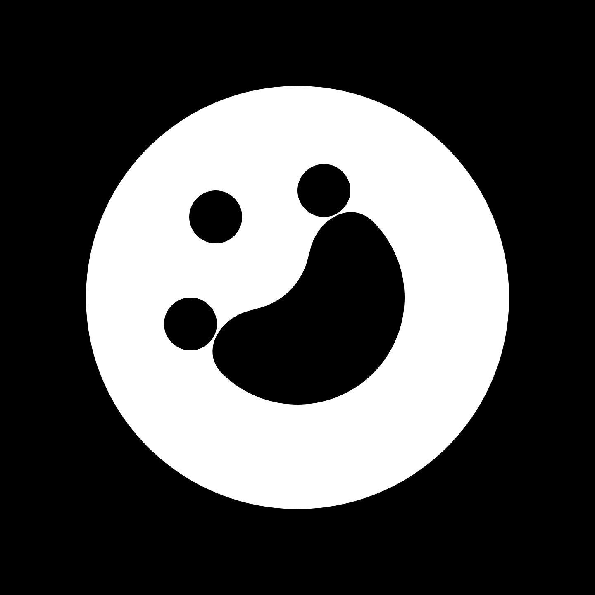
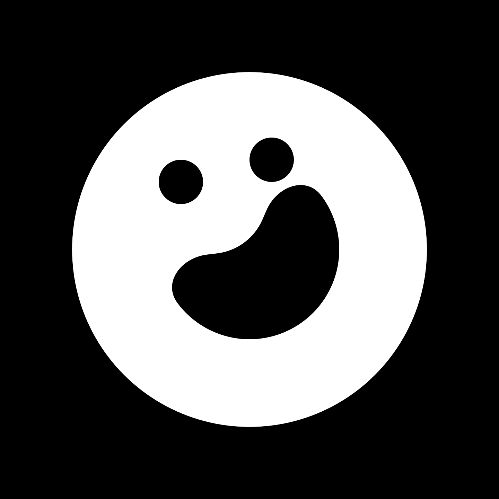

# **AI VIBE CODING HACKATHON**

Join _"AI VIBE CODING HACKATHON"_ organized by [Open Community](https://www.linkedin.com/company/opencommunity). Presented by [ANORA Labs](https://www.linkedin.com/company/anoralabs).

[Join the Hackathon](https://vibe.devpost.com/) | [Join the Discord fam](https://discord.gg/nUdcd9p8Ae)

hi, it's YapsGG! i love design and engineering. take a look my personal website [yaps.gg](https://yaps.gg)

Checkout my [LinkedIn](https://www.linkedin.com/in/abdibrokhim) | [YouTube](https://www.youtube.com/@yapsdotgg) | [X (Twitter)](https://twitter.com/abdibrokhim)

### Open-source Projects

[Lovido](https://github.com/abdibrokhim/loom-dl-web) – Free open source loom video downloader. (20 MAU)

[yaps[dot]chat](https://github.com/abdibrokhim/yaps.chat) – One-time end-to-end encrypted anonymous chats written in Rust.

[Zarin](https://github.com/abdibrokhim/zarin) – Free, open-source AI chat app with over 200 AI models.

[Wei](https://github.com/abdibrokhim/eliza-agent-orchestration) – The AI agents for personal growth with built-in memory/search support.

[MIDE](https://github.com/abdibrokhim/monday.com-ai-assistant-hackathon) – Built-in IDE that allows to run queries instantly inside monday.com in any language.

[MonkeytypeAI](https://github.com/abdibrokhim/monkeytype-ai) – A minimalistic and customizable AI-powered typing test.

[CoMed](https://github.com/abdibrokhim/CoMed-web) – The open source autonomous AI brain MRI analysis & diagnosis platform for doctors to help their patients. [Changelog](https://docs.google.com/document/d/1BUTYwI5xuNIV0FWmmQNmMErs6XXK30kDKoojktSwoJU/edit?usp=sharing)

[PaperAI](https://github.com/abdibrokhim/paper-ai-voice-assistant) – The open source collaborative AI research platform.

[EcoShopAI](https://chatgpt.com/g/g-rTTibE8p9-ecoshop-ai) – ChatGPT app that helps you find eco-friendly products and reduce your carbon footprint.

---

  
  
  
  
  

