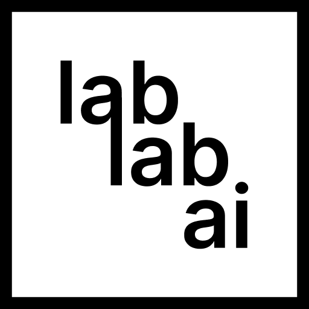

- 👋 Hi, I’m @abdibrokhim.
- 🧑‍🎓 Sophomore Student at New Uzbekistan University.
- 👨‍🎓 Graduated Student from Bobir Akilkhanov Academy.
- 🧑‍🎓 Mentor at LabLab.AI.
- 👀 I’m interested in Game and Software Development, AI/ML, Data Science, Music Production, 3D Modeling/Animation and Competitive Programming.
- 💞️ Do you have project? Let's Collab!
- 📫 How to reach me? 

All donations are Greatly Appreciated! 💛

 

|       |      |          |           |      |          |   |    |    |
| :----:        |    :----:   |     :----:    |    :----:   |    :----:   | :----:   |  :----:   |  :----:   |   :---:  |

  
    
  

  <vr/>

  
    
  

  
    
  

  
    
  

  
    
  

  
    
  

  
    
  

  
    
  

  
    
  

<!-- -
abdibrokhim/abdibrokhim is a ✨ special ✨ repository because its `README.md` (this file) appears on your GitHub profile.
You can click the Preview link to take a look at your changes.
--->

 
 

<!-- snake github progress -->

<!-- visiros count -->

  Visitor count
   
  

<!-- Widget -->
<!--  -->
